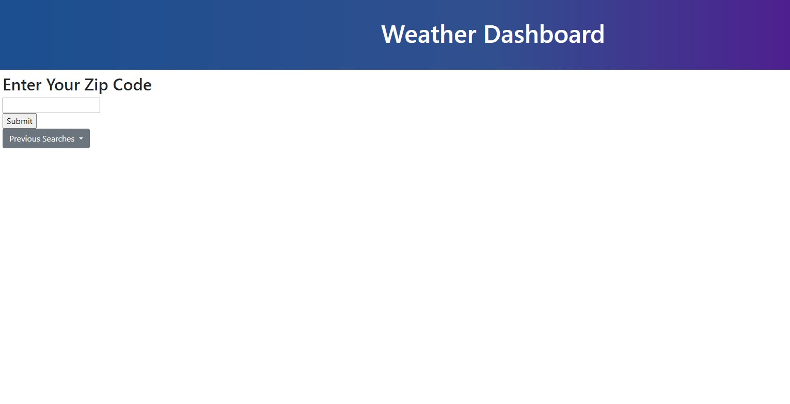
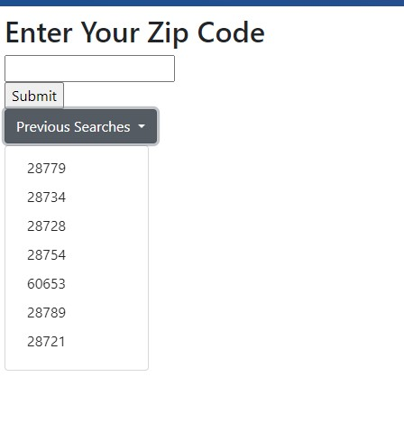
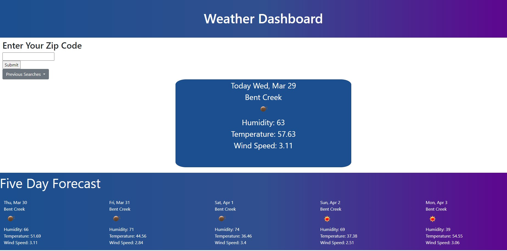
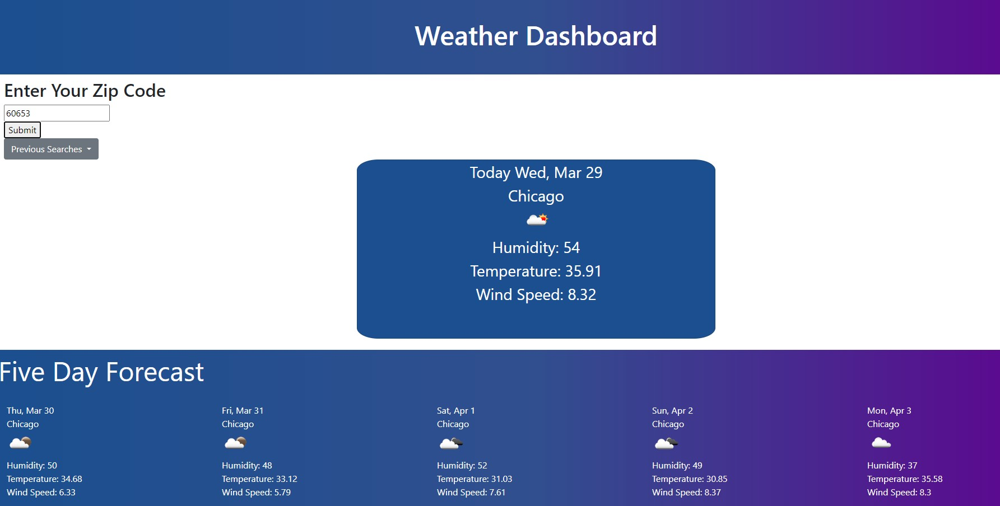
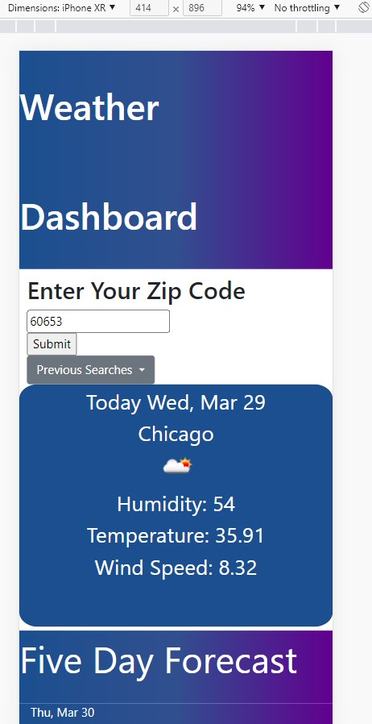
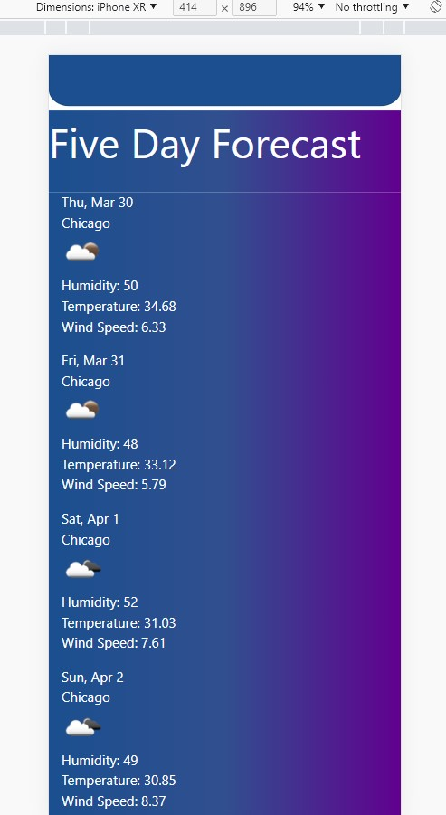

# Weather Dashboard
    Weather Dashboard Uses openweather api to retrieve weather data
    for a city by Zip Code.  When the Data is retrieved it also retrieves
    and displays the Forecast for the next Five Days.  As well Weather Dashboard
    Integrates Mobile Functionality too.
# Function
    Simply Enter your desired ZipCode click submit, or Select from your previous
    search history in the drop down selection box.
# Software and Program Credit
    Open Weather API from https://openweathermap.org/
    Day JS for date retrieval
    Bootstrap for CSS Styling
# Link to Deployed Page and Repository
    https://github.com/AJoelj84/WeatherDashboard
    

# Screenshots

